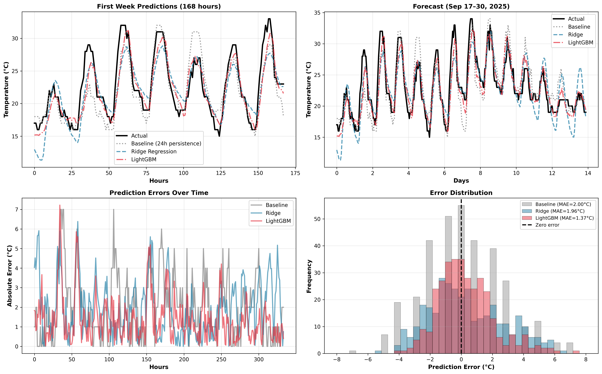

# Test Results (Sep 17–30, 2025)

- Baseline — MAE: 2.01°C, RMSE: 2.45°C, R²: 0.575
- Ridge — MAE: 1.77°C, RMSE: 2.19°C, R²: 0.661
- LightGBM — MAE: 1.15°C, RMSE: 1.46°C, R²: 0.849
- Best model: LightGBM

